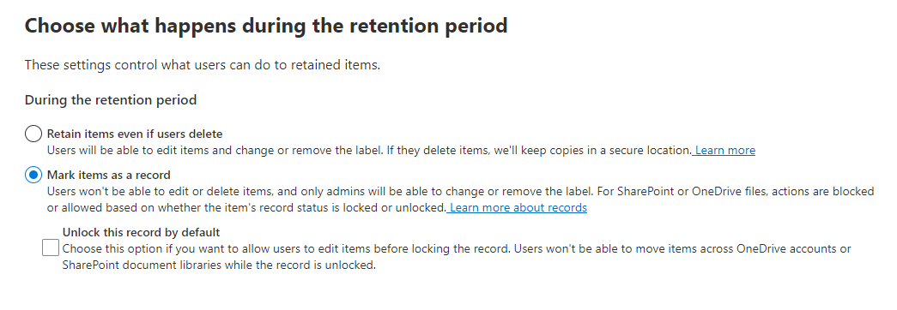
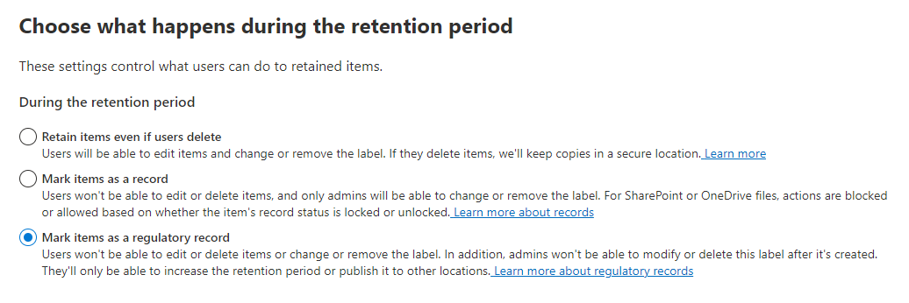

# Additional Information

Here you will find some information, which should help you understand or configure IP in M365.

## Sensitive information types

### SITs - Keyword List vs. Keyword dictionary

Limit | Value
------|------
Maximum number of custom SITs created through the Microsoft Purview compliance portal | 500
Maximum length of regular expression | 1024 characters
Maximum length for a given term in a keyword list | 50 characters
Maximum number of terms in keyword list | 2048
Maximum number of distinct regexes per SIT | 20
Maximum size of a keyword dictionary (post compression) | 1MB (~1,000,000 characters)
Maximum number of keyword dictionary based SITs in a tenant | 50

## Records Management

Records management allows you to declare labeled information as record. In opposite to a labeled information by Data lifecycle Management, a record cannot be changed ( ... and some more).

Records could be declared by a Records Management Label (File Plan). You will find the following option in the label creation wizard page _'Choose what happens during the retention period'_:



The option _Unlock this record by default_ allows you to modify the labeled information without changing this attribute first.

But it is also possible to make a file unchangeable if you use the following setting:



This third setting must be enabled via PowerShell first:

```PowerShell
Connect-IPPSSesion
Set-RegulatoryComplianceUI -Enabled $true
```

The impact is shown in this [link](https://learn.microsoft.com/en-us/purview/records-management#compare-restrictions-for-what-actions-are-allowed-or-blocked)

> :warning:Warning: It is important to know the implications of record labels, otherwise you may not be able to change or delete data.
